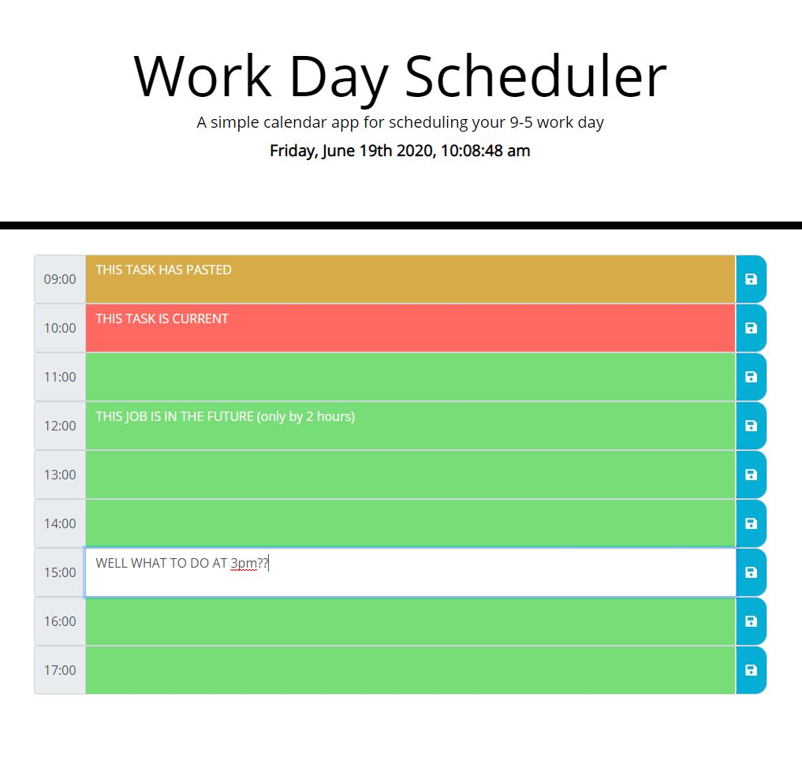

# plan-my-time-away
Daily planner from 9am to 5pm with displayed date and time.
Planner App link - https://emoschos.github.io/plan-my-time-away/

## Planner App Structure
The app structure was developed by keeping anything that was constant or static in html.
For example all the time-block rows were built in html and "not" dynamically added through Javascript.  These base elements will not change while using the app. This was to reduce the chances of introducing bugs when dynamically adding elements through JS.
JS was used to store and retreive information on the local storage, dynamically style the task descriptions based on time of day and to display the current date and time (down to seconds).

## App fucntionality
Each time-block textarea can be written into and the content then saved. The content will only be saved if the save button is "clicked".  If the save button is "not" clicked then the information is lost if the page is "refreshed" or "closed" and re-opened. 
When a textarea is selected then the background will be white so the user knows what task they are writing into. 
The dynamically styled time-blocks do not alter functionality but they will update when the hour changes and the app is open.

# Planner App Screenshot

